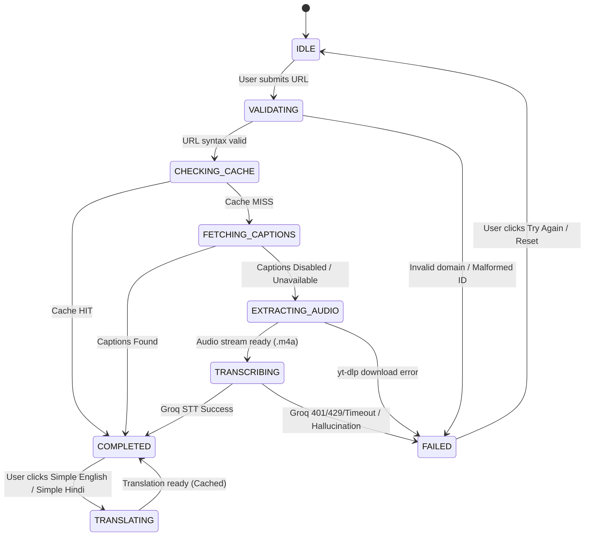

# Transcript Module — End-to-End Technical Documentation

**Subtitle:** YouTube Video URL → YouTube Captions → Groq Whisper Large V3 → Canonical Transcript → On-Demand Simple English / Simple Hindi  
**Audience:** Senior Developers, Engineering Managers, QA Engineers, DevOps/SRE, and Onboarding Engineers  
**Version:** 3.0 Production Ready  
**Last Updated:** September 2026  
**Status:** Active Production  

---

## 1. Executive Summary

### 1.1 Purpose & Business Problem
Video transcripts are foundational for content searchability, accessibility, internationalization, and downstream study. However, relying solely on third-party ASR (Automated Speech Recognition) APIs incurs massive runtime costs ($0.30 - $0.60 per video hour on traditional providers), while relying strictly on YouTube's built-in captions results in frequent failures when video creators disable transcripts, make videos unlisted, or upload uncaptioned media.

The **Transcript Module** solves this with a zero-cost, high-reliability dual-tier acquisition architecture:
1. **Zero-Cost First:** Automatically queries YouTube's official captions (both manual uploads and auto-generated ASR) at **$0.00 cost**.
2. **Groq Whisper Large V3 Fallback:** If captions are disabled, absent, or rate-limited, the system automatically falls back to lightweight audio extraction via `yt-dlp` and fast, high-accuracy transcription using **Groq Whisper Large V3** (`whisper-large-v3`, ~200x real-time speed at $0.111/hr).
3. **Canonical Normalization & Immutability:** All transcripts undergo an 8-stage NLP cleaning pipeline and hallucination loop detection. The resulting text is permanently cached as the canonical source of truth.
4. **On-Demand Derived Translation:** To minimize unnecessary LLM token expenditure, translation into **Simple English** and **Simple Hindi** is generated strictly on demand using Groq LLM (`openai/gpt-oss-120b` or `qwen/qwen3.8-27b`) with temperature 0.2 and strict pedagogical preservation rules (preserving formulas, numbers, and technical terms).

### 1.2 Core Architecture Pipeline

```text
YouTube Video URL / ID
          │
          ▼
   URL Resolver & Validation (Regex ^[A-Za-z0-9_-]{11}$)
          │
          ▼
   Multi-Tier Cache Check (Memory TTL + Disk JSON / Redis)
     ┌────┴────────────────────────┐
   HIT                             MISS
     │                               │ (Acquire Per-Video Concurrency Lock)
     │                               ▼
     │                      YouTube Captions API ($0.00)
     │                               │
     │                      ┌────────┴────────┐
     │                  Available        Unavailable / Disabled
     │                      │                 │
     │                      ▼                 ▼
     │               Caption Segments    Extract Audio (yt-dlp)
     │                      │                 │
     │                      │                 ▼
     │                      │          Groq Whisper Large V3
     │                      │                 │
     │                      └────────┬────────┘
     │                               │
     │                               ▼
     │                      8-Stage NLP Cleaning Pipeline
     │                               │
     │                               ▼
     │                      Quality & Hallucination Validator
     │                               │
     │                               ▼
     │                      Store Canonical Transcript in Cache
     │                               │
     └──────────────────────┬────────┘
                            │
                            ▼
               Requested Output Language?
              ┌─────────────┴─────────────┐
         "original"                   "en" or "hi"
              │                           │
              │                           ▼
              │                  Translation Cache Check
              │                   ┌───────┴───────┐
              │                 HIT              MISS
              │                   │               │
              │                   │               ▼
              │                   │      Groq LLM Translation
              │                   │      (Strict Prompt & Temp 0.2)
              │                   │               │
              │                   │               ▼
              │                   │      Store Derived Cache
              │                   └───────┬───────┘
              └───────────────────────────┤
                                          ▼
                               Structured JSON API Response
                                          │
                                          ▼
                               Interactive React Frontend
```

---

## 2. Module Scope

### 2.1 Included Functionality
- **URL Ingestion & Sanitization:** Normalizes `watch?v=`, `youtu.be/`, `shorts/`, `embed/`, `live/`, and bare 11-character video IDs. Rejects invalid domains, playlists, and channel URLs with structured HTTP 400 errors.
- **Captions Acquisition:** Scrapes and parses manual and auto-generated transcripts with timestamps via `youtube-transcript-api`.
- **Non-Terminating Fallback:** Captions unavailability automatically cascades to speech-to-text without aborting the client request.
- **Audio Extraction:** Audio-only extraction via `yt-dlp` using isolated, unique filenames and context-managed cleanup.
- **Groq Whisper Large V3:** High-speed STT with bounded exponential backoff on HTTP 429 rate limits, file size validation (<=25MB), and verbose JSON segment parsing.
- **8-Stage NLP Normalization:** Unicode NFC normalization, timestamp sorting, sentence boundary restoration, punctuation fixing, capitalization correction, and paragraph segmenting.
- **Quality & Hallucination Guardrails:** Detects degenerate ASR repetition loops (e.g. phrases repeated 5+ times consecutively or single words repeated 8+ times) and empty responses without penalizing short videos (<30s).
- **Multi-Tier Caching:** In-memory `TTLCache`, persistent disk JSON storage, and Redis connectivity.
- **Single-Flight Request Deduplication:** Double-checked locking prevents duplicate downloads and redundant Groq STT executions when simultaneous requests hit the same uncached video ID.
- **On-Demand Simple English & Simple Hindi Translation:** Derived translations generated on demand with strict preservation of numbers, names, code, and technical keywords.
- **Full Observability:** Thread-safe metric tracking (total requests, caption success rate, Groq fallback rate, average latency, translation hit rate).
- **Interactive UI:** 5-stage stepper (`VALIDATING`, `CHECKING_CACHE`, `FETCHING_CAPTIONS`, `EXTRACTING_AUDIO`, `TRANSCRIBING`, `COMPLETED`), 3-way language toggle, and copy tools.

### 2.2 Explicitly Not Included (Purged MVP #3 Scope)
The following legacy blog generation features were permanently removed and are **strictly excluded**:
- AI Blog generator pipelines and Markdown blog exporters.
- Long-form blog content analysis and SEO package generators.
- Document format exporters (`python-docx`, `fpdf2`).
- Blog-specific database models, tables, and Alembic migrations.
- Blog editor UI routes and components.

---

## 3. User Journey & UI State Machine

### 3.1 End-to-End User Flow
1. **Input Submission:** The user pastes a YouTube video URL (e.g. `https://www.youtube.com/watch?v=jNQXAC9IVRw`) into the Transcript interface.
2. **Client-Side Pre-Validation:** The frontend regex verifies that the string matches a supported YouTube URL or video ID format.
3. **Execution & Visual Stepper:** The user clicks **Get Transcript**. The UI enters the `VALIDATING` state and displays progress steps:
   - `VALIDATING` (0ms): Validating URL structure.
   - `CHECKING_CACHE` (300ms): Checking multi-tier transcript cache.
   - `FETCHING_CAPTIONS` (700ms): Attempting $0.00 YouTube captions.
   - `EXTRACTING_AUDIO` (2000ms, if captions fail): Extracting audio stream via yt-dlp.
   - `TRANSCRIBING` (4500ms, if STT active): Processing via Groq Whisper Large V3.
   - `COMPLETED`: Rendering clean transcript and timestamped segments.
4. **Language Selection:**
   - **Original:** Displays source language transcript with timestamped interactive cards.
   - **Simple English:** Derives accessible English simplification while retaining technical terms.
   - **Simple Hindi:** Derives natural Hindi (सरल और स्वाभाविक हिंदी) in Devanagari script.
5. **Copy & Export:** The user copies the transcript to the clipboard or downloads the JSON/CSV artifact.

### 3.2 Frontend State Machine Diagram



---

## 4. Component Deep-Dive

### 4.1 URL Resolution & Validation
- **Files:** [`services/youtube/resolver.py`](file:///f:/youtube-video-main/youtube-video-main/services/youtube/resolver.py), [`services/youtube_url_parser.py`](file:///f:/youtube-video-main/youtube-video-main/services/youtube_url_parser.py), [`utils/url_helpers.py`](file:///f:/youtube-video-main/youtube-video-main/utils/url_helpers.py).
- **Class:** `YouTubeResolver`
- **Method:** `resolve_video_id(url_or_id: str) -> str`
- **Mechanism:**
  - Direct 11-char regex check: `^[A-Za-z0-9_-]{11}$`.
  - Domain validation: Verifies `netloc` matches `youtube.com`, `m.youtube.com`, `music.youtube.com`, `youtu.be`, or `youtube-nocookie.com`.
  - Path parsing: Extracts ID from query (`?v=`), path (`/shorts/ID`, `/embed/ID`, `/live/ID`, `youtu.be/ID`).
  - Rejection: Raises `YouTubeURLError` on invalid domains or unsupported resources (`/channel/`, `/playlist`, `/@handle`).

### 4.2 YouTube Captions Service
- **Files:** [`services/youtube/captions.py`](file:///f:/youtube-video-main/youtube-video-main/services/youtube/captions.py), [`clients/youtube_transcript_client.py`](file:///f:/youtube-video-main/youtube-video-main/clients/youtube_transcript_client.py).
- **Class:** `YouTubeCaptionsService`
- **Method:** `fetch_captions(video_id: str, preferred_languages: Optional[List[str]]) -> Tuple[List[dict], str, bool]`
- **Mechanism:**
  - Queries `youtube-transcript-api` through `YouTubeTranscriptClient`.
  - Prioritizes manual human captions over auto-generated ASR.
  - Languages: Prioritizes requested languages (defaults to `["en", "hi"]`).
  - Exceptions: Catches `TranscriptsDisabledError`, `NoTranscriptFoundError`, `VideoUnavailableError`, and `TooManyRequestsError`, wrapping them into `CaptionsUnavailableError`.
  - **Crucial Invariant:** `CaptionsUnavailableError` does **not** fail the request; it signals `TranscriptService` to proceed to Step 4 (audio extraction).

### 4.3 yt-dlp Audio Extraction
- **File:** [`services/youtube/audio.py`](file:///f:/youtube-video-main/youtube-video-main/services/youtube/audio.py).
- **Class:** `YouTubeAudioExtractor`
- **Methods:** `extract_audio(video_id: str) -> Path`, `audio_context(video_id: str)`
- **Mechanism:**
  - Invokes `yt_dlp.YoutubeDL` programmatically via Python SDK (zero shell execution).
  - Format string: `"ba[ext=m4a]/ba/b"` extracts lightweight native audio streams without video overhead.
  - Concurrency Safety: Output template formatted as `tempfile.gettempdir() / "youtube_audio_stt" / f"{video_id}_{uuid.uuid4().hex[:8]}.%(ext)s"`.
  - Guaranteed Cleanup: The `audio_context` context manager guarantees `path.unlink(missing_ok=True)` in a `finally` block, ensuring zero leftover audio files even on STT failures or server timeouts.

### 4.4 Groq Whisper Large V3 Provider
- **File:** [`services/transcription/groq.py`](file:///f:/youtube-video-main/youtube-video-main/services/transcription/groq.py).
- **Class:** `GroqWhisperProvider(TranscriptionProvider)`
- **Method:** `transcribe(audio_path: Path, language: Optional[str]) -> TranscriptionResult`
- **Mechanism:**
  - SDK: Official Groq Python SDK (`from groq import Groq`).
  - Pre-flight validation: Checks `audio_path.stat().st_size <= 25 * 1024 * 1024` bytes.
  - API Call:
    ```python
    client.audio.transcriptions.create(
        file=(audio_path.name, audio_file),
        model="whisper-large-v3",
        response_format="verbose_json",
        temperature=0.0
    )
    ```
  - Rate-limit handling: HTTP 429 triggers bounded exponential backoff (`2 ** attempt` seconds).
  - Authentication handling: HTTP 401 triggers immediate `GroqAuthError` without retry.
  - Output Parsing: Extracts segments with start, end, duration, and text, standardizing language codes to ISO 639-1.

### 4.5 8-Stage NLP Cleaning Pipeline
- **Files:** [`services/transcription/cleaner.py`](file:///f:/youtube-video-main/youtube-video-main/services/transcription/cleaner.py), [`services/transcript_processor.py`](file:///f:/youtube-video-main/youtube-video-main/services/transcript_processor.py), [`pipeline/processing_pipeline.py`](file:///f:/youtube-video-main/youtube-video-main/pipeline/processing_pipeline.py).
- **Class:** `TranscriptCleaner`
- **Stages Executed in Sequence:**
  1. `TimestampProcessor`: Sorts segments by timestamp, validates monotonic non-negative start/end times.
  2. `CaptionMerger`: Merges micro-segments and fragments into coherent sentence phrases.
  3. `PunctuationProcessor`: Restores sentence terminal punctuation (`.`, `?`, `!`, `।`).
  4. `CapitalizationProcessor`: Standardizes sentence-initial capitalization and preserves brand/technical terms (Python, SQL, React, AWS, Docker).
  5. `ParagraphProcessor`: Groups conversational segments into logical paragraphs based on pause durations (>1.5s).
  6. `FillerProcessor`: Optional disfluency reducer (disabled by default to preserve verbatim speech fidelity).
  7. `LanguageProcessor`: Detects and verifies primary source language.
  8. `QualityChecker`: Computes word counts, character density, and readability metrics.
- **Devanagari Safety:** Unicode NFC normalization preserves Hindi codepoints (`\u0900-\u097F`).

### 4.6 Quality & Hallucination Validator
- **File:** [`services/transcription/validator.py`](file:///f:/youtube-video-main/youtube-video-main/services/transcription/validator.py).
- **Class:** `TranscriptValidator`
- **Method:** `validate(text: str, segments: List[dict], duration_seconds: float) -> ValidationReport`
- **Rules:**
  - **Empty Check:** Transcripts with 0 words raise `TranscriptEmptyError` (`TRANSCRIPT_EMPTY`).
  - **ASR Repetition Loop Detection:** Detects degenerate Whisper hallucination loops (single word repeating >=8 times consecutively, or 2-to-5-word n-grams repeating >=5 times consecutively). Raises `TranscriptValidationError` (`TRANSCRIPT_QUALITY_FAILED`).
  - **Short Video Safety:** Does not flag brevity issues if `duration_seconds <= 30` (prevents false positives on YouTube Shorts).
  - **Confidence Output:** Returns `confidence: 0.95` (down-weighted if warnings exist; never falsely claims "100% accuracy").

### 4.7 Multi-Tier Cache & Storage
- **File:** [`repositories/transcript_repository.py`](file:///f:/youtube-video-main/youtube-video-main/repositories/transcript_repository.py).
- **Class:** `TranscriptRepository`
- **Storage Strategy:**
  - **L1 (In-Memory):** `TTLCache[dict]` with 1-hour TTL.
  - **L2 (Persistent Disk):** Standard JSON files saved in `data/transcripts/{video_id}.json`.
  - **Derived Translations:** Saved separately as `data/transcripts/{video_id}_{safe_language}.json` (e.g. `jNQXAC9IVRw_hi_simple.json`), guaranteeing cross-platform filesystem safety.
- **Double-Checked Concurrency Lock:**
  ```python
  # Fast-path check
  cached = self.repository.get(video_id)
  if cached: return self._build_cache_response(video_id, cached)

  with _get_video_lock(video_id):
      # Re-check under lock
      cached = self.repository.get(video_id)
      if cached: return self._build_cache_response(video_id, cached)
      return self._acquire_and_persist(video_id, ...)
  ```

### 4.8 On-Demand Translation Service
- **Files:** [`services/translation/service.py`](file:///f:/youtube-video-main/youtube-video-main/services/translation/service.py), [`services/translation/english.py`](file:///f:/youtube-video-main/youtube-video-main/services/translation/english.py), [`services/translation/hindi.py`](file:///f:/youtube-video-main/youtube-video-main/services/translation/hindi.py).
- **Class:** `TranslationService`
- **Method:** `translate(video_id: str, original_text: str, target_language: str) -> Dict[str, Any]`
- **Model:** `openai/gpt-oss-120b` (fallback `qwen/qwen3.8-27b`) via Groq LLM API.
- **Hyperparameters:**
  - `temperature = 0.2` (minimizes creative hallucination).
  - `max_tokens = min(4096, max(300, len(words) * 3 + 100))` (prevents OTPM overages).
- **Pedagogical Translation Guardrails:**
  - **Zero Summarization:** Prompts forbid condensing or bulleting content.
  - **Technical Keyword Retention:** Preserves technical keywords, variable names, and programming terms in English/Roman script.
  - **Factual Fidelity:** Numbers, statistics, dates, and formulas are preserved verbatim.
  - **Derived Cache Keys:** Cached strictly under `transcript:{video_id}:en:simple` and `transcript:{video_id}:hi:simple`.

---

## 5. Unified API Contract

### 5.1 Ingestion Endpoint: `POST /api/transcript`

#### Request Payload
```json
{
  "video_url": "https://www.youtube.com/watch?v=jNQXAC9IVRw",
  "output_language": "original" 
}
```
*Allowed `output_language` values:* `"original"`, `"en"`, `"hi"`.

#### Successful Response (HTTP 200)
```json
{
  "success": true,
  "video_id": "jNQXAC9IVRw",
  "title": "Me at the zoo",
  "source_language": "en",
  "output_language": "original",
  "provider": "youtube_captions",
  "transcript": "All right, so here we are, in front of the elephants...",
  "segments": [
    {
      "start": 0.0,
      "end": 2.16,
      "duration": 2.16,
      "text": "All right, so here we are, in front of the elephants..."
    }
  ],
  "word_count": 38,
  "duration_seconds": 19.0,
  "confidence": 0.95,
  "from_cache": false,
  "trace_id": "8fa3c19e"
}
```

#### Derived Translation Response (`output_language: "hi"`)
```json
{
  "success": true,
  "video_id": "jNQXAC9IVRw",
  "title": "Me at the zoo",
  "source_language": "en",
  "output_language": "hi",
  "provider": "groq_openai/gpt-oss-120b",
  "transcript": "ठीक है, हम यहाँ हैं—हाथियों के सामने...",
  "segments": [],
  "word_count": 35,
  "duration_seconds": 19.0,
  "confidence": 0.95,
  "from_cache": false,
  "trace_id": "4225bb9f"
}
```

---

## 6. Error Taxonomy & Resilience Matrix

| Error Code | HTTP Status | Retryable | Root Cause | User Message |
|---|:---:|:---:|---|---|
| `INVALID_YOUTUBE_URL` | 400 | False | Domain is not YouTube or video ID format is invalid. | "Unsupported domain. Only YouTube URLs are supported." |
| `INVALID_REQUEST` | 400 | False | `output_language` not in `["original", "en", "hi"]`. | "Unsupported output_language. Must be 'original', 'en', or 'hi'." |
| `VIDEO_UNAVAILABLE` | 404 | False | Video is private, deleted, or regional copyright blocked. | "Video is unavailable or private." |
| `CAPTIONS_UNAVAILABLE` | 404 | False | Both captions and audio extraction fallback failed. | "YouTube captions and audio stream are unavailable." |
| `GROQ_AUTH_ERROR` | 401 | False | Backend `GROQ_API_KEY` is missing or invalid. | "Groq API key is missing or invalid. Check backend configuration." |
| `GROQ_RATE_LIMIT` | 429 | True | Groq upstream rate limit exceeded after 3 retries. | "Groq API rate limit reached. Please try again shortly." |
| `GROQ_TIMEOUT` | 504 | True | Groq Whisper request exceeded 120-second timeout. | "Groq transcription request timed out." |
| `AUDIO_EXTRACTION_FAILED` | 500 | True | `yt-dlp` failed to stream audio stream. | "Audio could not be extracted from this YouTube video." |
| `TRANSCRIPTION_FAILED` | 500 | True | Unrecoverable Groq STT provider exception. | "We could not generate a transcript for this video." |
| `TRANSCRIPT_EMPTY` | 422 | False | Audio contains zero discernible words. | "Transcript contains no text." |
| `TRANSCRIPT_QUALITY_FAILED` | 422 | False | Severe degenerate ASR repetition loops detected. | "Transcript quality failed: repetitive ASR hallucination loop detected." |
| `TRANSLATION_FAILED` | 500 | True | Groq LLM completion failed or timed out. | "We could not generate a translation for this video." |

---

## 7. Security Architecture & Threat Model

1. **Backend Key Isolation:** `GROQ_API_KEY` and `YOUTUBE_API_KEY` exist strictly in backend server memory. They are never transmitted over API responses, never rendered in frontend templates, and never printed in logs.
2. **SSRF Defense:** `utils/url_helpers.py` restricts domain parsing strictly to known YouTube hostnames (`youtube.com`, `m.youtube.com`, `youtu.be`). Attacker-controlled redirect targets or internal endpoints (`http://169.254.169.254`) are rejected with HTTP 400.
3. **Command Injection Elimination:** `yt-dlp` is executed exclusively via Python SDK (`yt_dlp.YoutubeDL(ydl_opts)`). No shell interpreter (`shell=True`) or `os.system` string concatenations exist.
4. **Path Traversal Protection:** Video IDs are strictly verified against `^[A-Za-z0-9_-]{11}$`. No `../` or arbitrary filepath injection can reach the disk storage layers.
5. **Sanitized Error Surfaces:** Stack traces are logged server-side with correlation IDs (`trace_id`). External clients receive clean, uniform JSON error structures.

---

## 8. Observability & SRE Runbook

### 8.1 Metrics Endpoint: `GET /api/transcript/metrics`
Exposes real-time KPIs without authentication or sensitive data:
```json
{
  "success": true,
  "metrics": {
    "total_transcript_requests": 4,
    "transcript_success_rate_percent": 100.0,
    "caption_attempts": 2,
    "caption_success_rate_percent": 100.0,
    "groq_fallback_rate_percent": 0.0,
    "groq_success_rate_percent": 100.0,
    "average_transcription_time_seconds": 0.0,
    "average_video_duration_seconds": 0.0,
    "average_transcript_word_count": 0.0,
    "translation_requests_total": 4,
    "translation_cache_hit_rate_percent": 50.0
  }
}
```

### 8.2 Operational Health Thresholds
- **Transcript Success Rate:** Target > 98%. Alert if < 95% over 15 minutes.
- **Caption Success Rate:** Expected baseline ~75-85%. (Fluctuations indicate YouTube changes or regional caption differences).
- **Groq Fallback Rate:** Expected baseline ~15-25%. A spike to 100% indicates YouTube caption API IP-throttling.
- **Translation Cache Hit Rate:** Target > 40% in recurring educational usage.

---

## 9. Testing & Quality Assurance

### 9.1 Test Execution Suite
Run the automated pipeline test suite:
```bash
python -m pytest tests/test_production_stt_pipeline.py -v
```

Run full regression verification:
```bash
python -m pytest tests/ -k "not integration and not live" -q
```

Validate frontend client build:
```bash
cmd.exe /c "npm --prefix frontend run build"
```

### 9.2 Automated Test Coverage Highlights
- `test_resolver_valid_urls`: Tests watch, youtu.be, shorts, embed, live, and bare ID formats.
- `test_resolver_invalid_urls`: Verifies rejection of external domains and malformed paths.
- `test_captions_disabled_fallback`: Verifies non-terminating fallback from `CaptionsUnavailableError` to STT.
- `test_groq_auth_missing_key`: Asserts fail-fast behavior when `GROQ_API_KEY` is missing.
- `test_transcript_cleaner`: Verifies sentence boundary, punctuation, and capitalization normalization.
- `test_transcript_validator_hallucination`: Tests synthetic detection of repeated Whisper hallucination loops.
- `test_translation_service_mock`: Asserts prompt construction and derived caching.

---

## 10. Deployment & Operations

### 10.1 Production Environment Variables (`.env`)
```bash
# YouTube Data API
YOUTUBE_API_KEY=AIzaSy...

# Groq API Configuration
GROQ_API_KEY=gsk_...
GROQ_WHISPER_MODEL=whisper-large-v3
GROQ_TRANSLATION_MODEL=openai/gpt-oss-120b
GROQ_TIMEOUT_SECONDS=120
GROQ_MAX_RETRIES=3

# Application Settings
LOG_LEVEL=INFO
REDIS_URL=redis://localhost:6379/0
RATE_LIMIT_PER_MINUTE=60
CORS_ORIGINS=https://yourproductiondomain.com
```

### 10.2 Production Docker Deployment
```bash
# Build and run containers
docker compose -f docker/docker-compose.yml up --build -d

# Verify container health
curl -f http://localhost:8000/api/health
curl -f http://localhost:8000/api/transcript/metrics
```

---

## 11. Troubleshooting Guide

| Symptom | Probable Cause | Diagnostic Command / Log Pattern | Action |
|---|---|---|---|
| `GROQ_AUTH_ERROR (401)` | `GROQ_API_KEY` is empty, unset, or revoked. | Search log for: `Groq authentication failed`. | Verify `GROQ_API_KEY` in `.env` starts with `gsk_` and restart backend. |
| `GROQ_RATE_LIMIT (429)` | Daily token quota exceeded on Groq. | Search log for: `rate_limit_exceeded` or `OTPM`. | Ensure `max_tokens` is configured or upgrade Groq tier. |
| `AUDIO_EXTRACTION_FAILED (500)` | Video is geo-restricted or missing FFmpeg. | Search log for: `Audio extraction failed for <vid>`. | Verify `ffmpeg -version` is installed on host / container. |
| Slow Response (>10s) | First-time audio download on long video. | Search log for: `[Step 4] Audio ready at...`. | Normal for non-captioned videos; cached on subsequent requests. |
| Characters garbled in Hindi | Terminal character encoding issue. | Check UTF-8 output decoding. | Server handles UTF-8 natively; ensure client terminal supports UTF-8. |

---

## 12. Developer Extension Guide

### Adding a New Translation Language
1. **Define the Specification:** Create `services/translation/{language}.py` defining `SIMPLE_{LANG}_SYSTEM_PROMPT` with strict rules (preserving technical terms, numbers, formulas, and zero summarization).
2. **Register in Service:** Update `services/translation/service.py` to recognize the new language code in `translate()`.
3. **Register in API Route:** Add the language code to `out_lang` validation in [webapp/main.py:L546](file:///f:/youtube-video-main/youtube-video-main/webapp/main.py#L546).
4. **Update Frontend UI:** Add the language option to `OutputLanguage` in `frontend/src/types/index.ts` and the selector in `frontend/src/pages/Transcript.tsx`.
5. **Add Automated Test:** Add a test case in `tests/test_production_stt_pipeline.py`.
